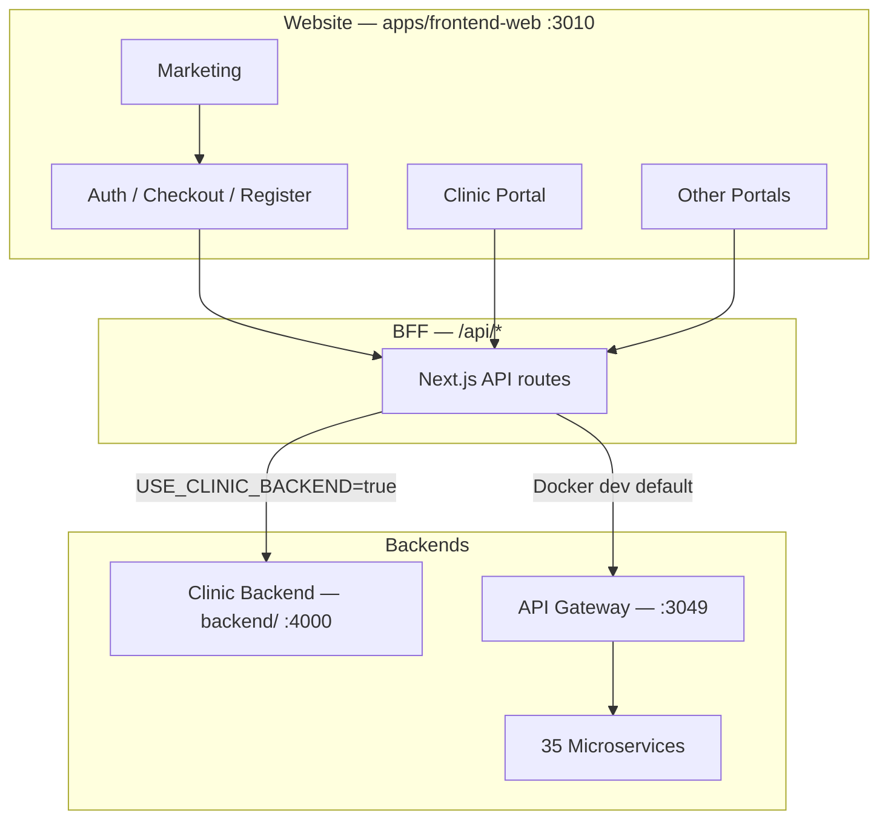

# Ordella Physio — Implementation Audit & Tracker

> **Purpose:** Living reference for what is implemented, what appears on the website, gaps, and planned work.  
> **See also:** [services-inventory.md](./services-inventory.md) — complete service/sub-service list and status matrix.  
> **Last updated:** 2026-06-20 (billing E2E 15/15; pharmacy + POS terminal; dev stack cleanup; Stripe E2E catalog bootstrap)  
> **Primary frontend:** `apps/frontend-web` (port 3010)  
> **Primary backends:** `backend/` (clinic monolith) + `services/*` (35 microservices via API gateway)

---

## How to use this document

1. **Audit sections** — snapshot of implementation vs website reflection (baseline from full-repo review).
2. **Tracker tables** — update status as work ships (`Not started` → `In progress` → `Done`).
3. **Changelog** — append dated entries at the bottom when material changes land.

**Status legend**

| Symbol | Meaning                                                        |
| ------ | -------------------------------------------------------------- |
| ✅     | Complete / reflected on site                                   |
| ⚠️     | Partial / inconsistent                                         |
| ❌     | Missing or not reflected                                       |
| 🔒     | Deferred (see `.cursor/rules/security-hardening-deferred.mdc`) |

---

## Policy decisions

| Date       | Decision                                                                                                                                                                                                                                                                          |
| ---------- | --------------------------------------------------------------------------------------------------------------------------------------------------------------------------------------------------------------------------------------------------------------------------------- |
| 2026-06-16 | **Keep all patient APIs and routes** — `/api/patients/*`, patient BFF proxies, and `/patient/*` portal pages/endpoints must not be deleted during cleanup or consolidation. Legacy scaffold at `/patients` (plural, non-portal) may redirect later; patient portal and APIs stay. |

---

## Executive summary

Ordella Physio runs on **two parallel backend paths**:

| Path                          | Location                                    | Typical use                                 |
| ----------------------------- | ------------------------------------------- | ------------------------------------------- |
| **Clinic backend (monolith)** | `backend/` — Express + Prisma               | Local `pnpm dev`, `USE_CLINIC_BACKEND=true` |
| **Microservices**             | 35 NestJS services + `services/api-gateway` | `docker-compose.dev.yml` / full stack       |

The **live website** is **`apps/frontend-web`**. Legacy apps (`apps/web`, `apps/marketing-site`, `apps/app`, `apps/admin-dashboard`) are not deployed in Docker and largely duplicate older splits.

**Overall:** Marketing + auth/onboarding + clinic portal core are implemented and wired. **Gateway-mode billing** (hybrid tenant/org truth, Stripe Checkout, webhook lifecycle) shipped 2026-06-17. **Enterprise SSO** and **secure file uploads** shipped 2026-06-17. **Local dev login + super-admin overview** fixed 2026-06-17. **Billing Playwright E2E: 15/15 passing** (2026-06-20) — tenant/org lifecycle, webhooks, failure cases, **browser Stripe hosted checkout with test card**, platform metrics (`mrrStripeLive`). **Pharmacy-service** + portal CRUD/fulfillment shipped; **terminal-service** POS pairing/sessions/payments + clinic UI. **Dev stack:** `subscription-billing-service` removed from `docker-compose.dev.yml`; gateway aliases `/subscription-billing/*` → billing-service. **Messaging/notifications:** SSE stream, delivery logs, readiness probes. **File uploads:** ClamAV + MIME validation on clinic-backend + file-storage path. **Remaining:** notification-provider Docker rebuild verification; commit uncommitted routing/gateway fixes; production `CLAMAV_REQUIRED=true`; optional Stripe Dashboard AI-notes invoice verification; delete `services/subscription-billing/` tree after client migration (see `DEPRECATED.md`).

---

## 1. Platform & infrastructure

| Area                                        | Backend             | Website | On site? | Tracker          |
| ------------------------------------------- | ------------------- | ------- | -------- | ---------------- | --- | ---------------------------------------------- | --- | --- | --- | ---- |
| Multi-tenant architecture                   | ✅                  | ✅      | ✅       | Done             |
| Auth (login, refresh, logout, MFA)          | ✅                  | ✅      | ✅       | Done             |
| CSRF, rate limits, CSP                      | ✅                  | ✅      | ✅       | Done             |
| Audit logging                               | ✅                  | ✅      | ✅       | Done             |     | Docker dev stack (18 svc + gateway + frontend) | ✅  | N/A | N/A | Done |
| Docker full stack (34+ svc + observability) | ✅                  | N/A     | N/A      | Done             |
| Encrypted backups + cron                    | ✅                  | N/A     | N/A      | Done             |
| Dual-backend routing (`USE_CLINIC_BACKEND`) | ✅                  | ✅      | ✅       | Done — flag-only (URL presence no longer enables monolith mode; fix uncommitted) |
| Enterprise SSO (SAML/OIDC)                  | ✅ org + enterprise + auth services | ✅ `/clinic/enterprise` + login SSO button | ✅ | Done (2026-06-17) |
| Secure file uploads (S3 + ClamAV pipeline)  | ✅ file-storage + clinic-backend proxy | ✅ `file-api.ts` signed URL flow | ⚠️ | Partial — ClamAV wired when `CLAMAV_ENABLED=true`; MIME validation on upload handlers |
| ClamAV on upload                            | ✅ file-storage scan + clinic-backend validation | N/A | N/A | ⚠️ Partial — enable `CLAMAV_REQUIRED=true` in production |
| Automated JWT key rotation                  | Manual overlap only | N/A     | N/A      | 🔒 Deferred      |

---

## 2. Onboarding & monetization

| Feature                                 | Backend                                                    | Website route                                                 | On site? | Tracker                                                                   |
| --------------------------------------- | ---------------------------------------------------------- | ------------------------------------------------------------- | -------- | ------------------------------------------------------------------------- |
| Pricing page                            | Shared `lib/pricing-plans.ts`                              | `/pricing`                                                    | ✅       | Done                                                                      |
| Checkout (trial + paid)                 | `/api/onboarding/`\*                                       | `/checkout`                                                   | ✅       | Done (layout refactor 2026-06)                                            |
| Register (late signup)                  | `POST /register`                                           | `/register`                                                   | ✅       | Done                                                                      |
| Trial duration (dynamic)                | `GET /config`                                              | Checkout + register                                           | ✅       | Done                                                                      |
| VAT-aware paid summary                  | Preview + client helpers                                   | Checkout summary                                              | ✅       | Done                                                                      |
| Profile completion wizard               | Tenant profile API                                         | `/clinic` home                                                | ✅       | Done                                                                      |
| CSRF on register/checkout BFF           | BFF + fetcher                                              | Auth flows                                                    | ✅       | Done (2026-06)                                                            |
| Platform paid checkout (Stripe capture) | Stripe Checkout Session (`POST /billing/checkout-session`) | `/checkout` → Stripe redirect (gateway); card form (monolith fallback) | ✅ | Done — gateway default; **browser E2E verified** (2026-06-20) |
| Stripe subscription (in-portal upgrade) | billing-service + hybrid truth                             | `/clinic/billing`, `/organization/billing`                    | ⚠️       | **Partial** — panel + webhooks wired; live keys + 15-test E2E suite green locally |
| Super-admin full provisioning           | `POST /super-admin/provisioning/full`                      | `/super-admin/provisioning/new` wizard                        | ✅       | Done (2026-06-17)                                                         |
| Owner assignment at tenant create       | auth + tenant internal APIs                                | Tenant create + provisioning forms                            | ✅       | Done (2026-06-17)                                                         |

---

## 3. Clinic backend (`backend/`) — domain map

Base path: `/api`. Tenant-scoped routes require auth + tenant header.

| Domain                      | API status              | Website (`/clinic/`\*)                | On site? | Tracker                 |
| --------------------------- | ----------------------- | ------------------------------------- | -------- | ----------------------- |
| Auth (login, users, invite) | ✅                      | Login, users                          | ✅       | Done                    |
| Auth — password reset       | ✅ Email + JWT token    | `/forgot-password`, `/reset-password` | ✅       | Done (monolith 2026-06) |
| Onboarding                  | ✅                      | Checkout, register                    | ✅       | Done                    |
| Tenant profile / trial      | ✅                      | Profile wizard, trial banner          | ✅       | Done                    |
| Patients                    | ✅ CRUD, statements     | Patients                              | ✅       | Done                    |
| Appointments                | ✅ + auto-invoice       | Appointments, calendar                | ✅       | Done                    |
| Therapists                  | ✅                      | Therapists                            | ✅       | Done                    |
| Staff                       | ✅                      | Staff                                 | ✅       | Done                    |
| Billing (clinic invoices)   | ✅                      | Billing                               | ✅       | Done                    |
| Notes                       | ✅ CRUD                 | Notes                                 | ✅       | Done — PATCH/DELETE     |
| Reports                     | ✅ Basic                | Reports                               | ✅       | Done                    |
| Notifications               | ⚠️ Email; SMS/push stub | Topbar + page                         | ⚠️       | Partial                 |
| RBAC                        | ⚠️ Assign only          | Users, roles                          | ⚠️       | Partial                 |
| Audit logs                  | ✅                      | Audit logs                            | ✅       | Done                    |
| Locations (data model)      | ❌ Monolith             | `/clinic/locations` via gateway       | ⚠️       | Depends on backend mode |
| File uploads                | ✅ Gateway path via file-storage-service + ClamAV/MIME | Attachments UI (`file-api.ts`) | ⚠️ | Partial — production `CLAMAV_REQUIRED=true` |

### Clinic-backend endpoint quick reference

```
GET  /api/health
/api/auth/*           — csrf, login, refresh, logout, forgot-password, password/request, password/reset, register, me, users
/api/onboarding/*     — config, register, start-trial, checkout/preview, checkout/complete

[tenant-scoped]
/api/tenant/*         — trial, profile
/api/patients/*       — CRUD, profile, service-statement pdf/email
/api/appointments/*   — CRUD, availability, status, cancel, complete
/api/therapists/*     — CRUD, schedule, service-types, me
/api/staff/*          — CRUD, permissions, roles
/api/billing/*        — invoices, outstanding, payments, pdf
/api/notes/*          — list, get, create, patch, delete
/api/reports/*        — summary, revenue
/api/notifications/*  — list, send, templates, read
/api/rbac/*           — roles, assign
/api/audit-logs       — list
```

---

## 4. Microservices (`services/`) — grouped inventory

Routed via **api-gateway** (`:3049`). Dev compose runs **17** domain services + gateway; full stack runs **34** + observability.

| Group                     | Services                                                                                      | Implementation                                                             | On website?                 | Tracker                                                            |
| ------------------------- | --------------------------------------------------------------------------------------------- | -------------------------------------------------------------------------- | --------------------------- | ------------------------------------------------------------------ |
| Core                      | auth, tenant, organization, user-role, staff, audit, feature-flags, event-bus                 | Provisioning + org/tenant CRUD mostly complete                             | Partial (super-admin)       | Ongoing — users list/create partial                                |
| Clinical                  | patient, appointment, notes, **terminal**, **pharmacy**                                     | Complete vs monolith; POS pairing/sessions/payments; pharmacy CRUD + fulfillment | ✅ Via BFF/gateway | Done (terminal + pharmacy 2026-06-20)                              |
| Billing                   | billing (primary), payment, subscription-billing (deprecated, **removed from dev compose**) | Hybrid truth, Checkout Session, webhooks, lifecycle sync, platform metrics (`mrrStripeLive`) | ⚠️                          | Partial — **15/15 billing E2E**; Stripe-live metrics when keys set |
| Comms                     | notification, notification-provider, communication, messaging                                 | SSE `/messaging/stream`; Twilio/Firebase env-gated; delivery logs UI           | ✅ Topbar + logs    | Partial — notification-provider Docker Alpine binary flaky         |
| Reporting & search        | reporting, search-index                                                                       | Placeholder exports, ES stub                                               | ✅ Search topbar            | Partial                                                            |
| Integrations              | file-storage, marketplace                                                                     | S3 signed URLs + virus scan path; marketplace catalog                      | ✅ Clinic nav               | Partial — uploads live on gateway path                             |
| Enterprise                | enterprise                                                                                    | SAML/OIDC SSO flows, API keys, webhooks, org SSO config                    | ✅ Clinic nav + SSO login   | Done (2026-06-17)                                                  |
| AI platform (10 services) | ai, ai-notes, ai-gateway, training, monitoring, deploy, security, cost, observability, agents | Scaffold + mocks                                                           | ✅ Clinic nav (AI platform) | Partial — routes + nav                                             |

---

## 5. Website surfaces (`apps/frontend-web`)

| Surface             | ~Routes                       | Status                                                           | Tracker                                      |
| ------------------- | ----------------------------- | ---------------------------------------------------------------- | -------------------------------------------- |
| Marketing           | 10+                           | ✅ Static + contact API                                          | Done                                         |
| Auth / onboarding   | 12+                           | ✅ Mostly live                                                   | Done                                         |
| Clinic portal       | ~110                          | ✅ Core in sidebar + API                                         | Done                                         |
| Staff portal        | ~18                           | ✅ Live                                                          | Done                                         |
| Therapist portal    | ~17                           | ✅ Live                                                          | Done                                         |
| Super admin         | ~33                           | Provisioning + org/tenant CRUD + platform billing metrics        | ⚠️ Metrics live when Stripe keys + E2E catalog synced |
| Organization portal | 2+                            | `/organization/billing` (+ upgrade + org shell/nav)              | Partial — billing-focused nav                |
| Patient portal      | ~10                           | ✅ Full nav                                                      | Done (nav) — **keep `/patient` APIs/routes** |
| Pharmacy portal     | ~13                           | ✅ Gateway → pharmacy-service; create/edit/issue/fulfillment UI   | Done — auxiliary patient/appointment/billing reads are cross-service, not fallbacks |
| User portal         | ~10                           | ✅ Live                                                          | Done                                         |
| Legacy scaffolds    | `/patients`, `/billing`, etc. | ✅ Redirect to `/clinic/`\*                                      | Done                                         |
| Settings            | `/settings/*`                 | ✅ Delivery logs page added                                      | Partial                                      |
| Admin / clinic AI   | ~70                           | ✅ In clinic sidebar (AI platform)                               | Partial — productize workflows               |

### Marketing funnel (current)

```
/pricing → /checkout?plan&cycle&intent
  ├─ trial + unauthenticated → /register → workspace API → /clinic or back to /checkout
  ├─ trial + authenticated → /clinic
  └─ paid (gateway/Docker) → Stripe Checkout Session → /checkout/success → /clinic
  └─ paid (monolith, dev only) → Stripe Checkout via gateway BFF unless NEXT_PUBLIC_ALLOW_DB_CHECKOUT=true (DB fallback)
```

### Clinic sidebar (linked today)

Overview → `/clinic`, Patients, Appointments, Therapists, Staff, Billing, Notes, Messages, Notifications, Marketplace, Enterprise, AI platform, Users, Roles, Locations, Terminals, Reports, Audit logs, Settings.

**Also available (not all in sidebar):** Search, Dashboard, Automation sub-routes under `/clinic/ai/`_ and `/clinic/automation/_`.

---

## 6. Website reflection matrix (gaps)

| Capability                                     | On site? | Gap                                                                         | Priority | Tracker                                          |
| ---------------------------------------------- | -------- | --------------------------------------------------------------------------- | -------- | ------------------------------------------------ |
| Pricing → checkout → register                  | ✅       | —                                                                           | —        | Done                                             |
| Paid checkout payment capture                  | ✅       | **15/15 Playwright billing E2E** incl. browser Stripe test card (2026-06-20) | —        | Done (local; needs prod keys in deploy env)      |
| Clinic billing Stripe UX                       | ⚠️       | Hybrid truth, org/clinic UI, webhook lifecycle                              | P1       | Partial — see billing-architecture.md            |
| Hybrid billing truth (`billingModel`)          | ✅       | Context API + migrations + UI routing                                       | P1       | Done (gateway mode)                              |
| Super-admin atomic provisioning                | ✅       | Full wizard + rollback compensation                                         | P1       | Done                                             |
| AI Notes usage metering                        | ⚠️       | Usage counter + internal sync; E2E verifies count + webhooks; optional live Stripe invoice line | P2       | Partial — dashboard verification optional for mock-activated tenants |
| Password reset (monolith)                      | ✅       | Email + token routes                                                        | P1       | Done                                             |
| AI / automation / marketplace / enterprise nav | ✅       | Clinic sidebar                                                              | P2       | Done (nav)                                       |
| Patient portal full nav                        | ✅       | Appointments, billing, notes, messages                                      | P2       | Done — **keep `/patient` APIs/routes**           |
| `/settings/notifications/logs`                 | ✅       | Delivery logs page                                                          | P2       | Done                                             |
| Legacy `/patients`, `/billing` scaffolds       | ✅       | Redirect to `/clinic/`\*                                                    | P3       | Done                                             |
| Notes edit/delete                              | ✅       | PATCH/DELETE on monolith                                                    | P3       | Done                                             |
| Pharmacy real API                              | ✅       | `pharmacy-service` + BFF `/api/pharmacy` → gateway (no monolith fallback)   | P3       | Done (2026-06-20)                                |
| Super-admin login (gateway mode)               | ✅       | `USE_CLINIC_BACKEND=false` + `demo-tenant`; flag-only backend toggle        | P1       | Done (local; uncommitted)                        |
| Super-admin overview API noise                 | ⚠️       | Tenant directory, auth hydration, builtin roles; billing optional on overview | P2     | Done (local; uncommitted)                        |
| Super-admin MRR/revenue                        | ⚠️       | `GET /billing/platform-metrics` → `mrrStripeLive`; E2E asserts when keys set | P3       | Partial — live data env-dependent                |
| POS terminal (pair + checkout)                 | ✅       | `/clinic/terminals/[id]/pair`, `/clinic/pos/[terminalId]`, terminal-service | P2       | Done (2026-06-20)                                |
| Local dev: port 3010 conflict                  | ⚠️       | `next dev` and Docker `frontend` both bind `:3010` — use one at a time      | P2       | Documented — see ops-reference                   |

---

## 7. Legacy & duplicate apps

| App                    | Port | Status                     | Tracker                      |
| ---------------------- | ---- | -------------------------- | ---------------------------- |
| `apps/frontend-web`    | 3010 | **Active — primary**       | Done                         |
| `apps/web`             | 3000 | Legacy duplicate marketing | Deprecated — `DEPRECATED.md` |
| `apps/marketing-site`  | 3001 | Legacy duplicate           | Deprecated — `DEPRECATED.md` |
| `apps/app`             | 3001 | Legacy early dashboard     | Deprecated — `DEPRECATED.md` |
| `apps/admin-dashboard` | 3000 | Legacy admin UI            | Deprecated — `DEPRECATED.md` |
| `apps/mobile-app`      | Expo | Separate track             | Out of scope                 |

---

## 8. Documentation alignment

| Document                        | Trust level                      | Issue                                                        | Tracker            |
| ------------------------------- | -------------------------------- | ------------------------------------------------------------ | ------------------ |
| `docs/ops-reference.md`         | High for Docker dev              | Path note: compose at repo root                              | OK                 |
| `docs/security-architecture.md` | High                             | Matches current stack                                        | OK                 |
| `README.md`                     | Monolith + microservices pointer | Updated 2026-06                                              | OK                 |
| `docs/master-index.md`          | Blueprint + tracker link         | Partial refresh                                              | OK                 |
| `docs/billing-architecture.md`  | Billing modes                    | New 2026-06                                                  | OK                 |
| `docs/runbooks/jwt-rotation.md` | Manual JWT rotation              | New 2026-06                                                  | OK                 |
| `docs/architecture.md`          | Medium                           | Refreshed to current dual-backend + frontend-web-first model | Updated 2026-06-17 |

---

## 9. Phased roadmap (suggested — awaiting approval)

### Phase 1 — Stabilize user-facing UX (P1)

- [x] Pick one billing truth: documented in [billing-architecture.md](./billing-architecture.md) (gateway+Stripe vs monolith DB)
- [x] Hybrid billing truth model: `billingModel` on org, context API, org Stripe accounts, UI routing
- [x] Remove Stripe “coming soon” placeholder on `/clinic/billing` (use subscription panel only)
- [x] Fix broken `/settings/notifications/logs` (delivery logs page)
- [x] Implement monolith password reset (`POST /api/auth/password/request`, `/password/reset`)
- [x] Align trial banner upgrade path → `/checkout?intent=checkout`

### Phase 2 — Consolidate repo (P2)

- [x] Deprecate `apps/web`, `marketing-site`, `app`, `admin-dashboard` (`DEPRECATED.md` + README)
- [x] Redirect legacy `/patients`, `/billing`, `/appointments`, `/notes` scaffolds → `/clinic/`\*
- [x] Refresh `master-index.md` tracker link (live inventory in audit tracker)

### Phase 3 — Complete monetization (P1–P2)

- [x] Stripe Checkout for platform onboarding (gateway path via `POST /billing/checkout-session`)
- [x] Webhooks → tenant `ACTIVE` / `SUSPENDED` lifecycle sync (billing-service → tenant-service)
- [x] Hybrid billing truth model (see Phase 1)
- [x] AI notes usage counter (`aiNotesUsageCount` on tenant subscription)
- [x] **Verify webhook forwarding** with Stripe test keys + `stripe listen` (fixture events → `201`)
- [x] **Verify end-to-end** browser checkout + tenant lifecycle in UI (**15/15** `pnpm billing-e2e`, 2026-06-20)
- [x] Deprecate or redirect `subscription-billing-service` webhooks/UI to billing-service (dual stack risk; **removed from dev compose**)
- [x] Stripe-first checkout default even when `USE_CLINIC_BACKEND=true` (`NEXT_PUBLIC_ALLOW_DB_CHECKOUT` for dev fallback)
- [ ] AI Notes add-on billing — optional Stripe Dashboard invoice-line verification for live subscriptions (E2E covers usage + webhooks)
- [ ] Invoice line items / tax rates at scale (clinical billing already in billing-service)

### Phase 4 — Productize differentiators (P3+)

- [x] AI notes in therapist workflow (`NotesEditor` + `AiNotesAssistant`)
- [ ] Marketplace: one integration E2E (calendar or Zoom)
- [x] Patient portal: appointments + billing read-only nav
- [ ] Real search backend when volume warrants

### Phase 5 — Enterprise & compliance

- [x] Enterprise SSO UI (`/clinic/enterprise` in nav)
- [x] Enterprise SSO backend (SAML/OIDC, org config, encrypted secrets, auth provisioning, audit)
- [x] JWT rotation runbook ([runbooks/jwt-rotation.md](./runbooks/jwt-rotation.md))
- [ ] ClamAV on uploads before PHI documents ship — **wired locally**; set `CLAMAV_REQUIRED=true` in production

### Phase 6 — Super-admin & platform ops (P2)

- [x] Atomic org → tenant → owner provisioning (`POST /super-admin/provisioning/full`)
- [x] Owner assignment during tenant create (`ownerUserId` or `ownerEmail`)
- [x] Super-admin login via gateway BFF (`demo-tenant` seed, `USE_CLINIC_BACKEND=false`)
- [x] Super-admin overview: tenant directory list, auth-ready queries, builtin role resolution
- [ ] Super-admin platform users CRUD polish (list filters, create form edge cases)
- [x] Super-admin MRR / revenue dashboard (`GET /billing/platform-metrics`; Stripe-live when keys set)
- [x] E2E tests: billing checkout + webhook activation (**15/15** `billing-e2e.spec.ts`)
- [ ] E2E tests: provisioning rollback suite (separate spec exists; expand coverage)

---

## 11. Remaining work (prioritized)

### P1 — Before production billing ✅ (2026-06-17)

| Item                             | Status                                                                                           |
| -------------------------------- | ------------------------------------------------------------------------------------------------ |
| Stripe smoke test docs           | ✅ `docs/ops-reference.md` §3b                                                                   |
| Consolidate subscription-billing | ✅ `DEPRECATED.md`, `/settings/billing` → `/clinic/billing`                                      |
| Monolith paid checkout           | ✅ Default Stripe via `preferStripeCheckout()`; `NEXT_PUBLIC_ALLOW_DB_CHECKOUT` for dev fallback |

### P2 — Product completeness ✅ (2026-06-17) · billing E2E ✅ (2026-06-20)

| Item                          | Status                                                                                  |
| ----------------------------- | --------------------------------------------------------------------------------------- |
| Onboarding BFF in Docker      | ✅ Gateway `/api/onboarding` → `CLINIC_BACKEND_URL`                                     |
| Organization portal nav       | ✅ Dedicated org shell + nav                                                            |
| AI notes therapist UX         | ✅ Already in `NotesEditor` / `AiNotesAssistant`                                        |
| AI notes usage display        | ✅ `aiNotesUsageCount` on billing context + clinic billing panel                        |
| AI notes metered billing sync | ✅ `tenant-service` → `billing-service` internal invoice item (`STRIPE_PRICE_AI_NOTES`) |
| File uploads + ClamAV         | ✅ S3 signed URL pipeline + scan/MIME validation; ⚠️ `CLAMAV_REQUIRED=true` in prod   |
| Messaging SSE + delivery logs | ✅ `GET /messaging/stream`; `/settings/notifications/logs`                              |
| POS terminal + pharmacy       | ✅ terminal-service + pharmacy-service; clinic UI routes                              |
| Billing Playwright E2E        | ✅ **15/15** — lifecycle, webhooks, browser Stripe checkout, platform metrics           |
| Local dev frontend            | ⚠️ Use **either** `pnpm --filter @ordella/frontend-web dev` **or** Docker `frontend` on `:3010` |

**Still open (P2):** Rebuild notification-provider Docker image; commit frontend dual-backend + gateway readiness allowlist.

### P3 — Later / scale ✅ (2026-06-17) · dev stack cleanup ✅ (2026-06-20)

| Item                           | Status                                                                     |
| ------------------------------ | -------------------------------------------------------------------------- |
| Pharmacy API                   | ✅ `pharmacy-service` + gateway BFF (no monolith fallback)                 |
| Super-admin MRR dashboard      | ✅ `GET /billing/platform-metrics` + super-admin UI + E2E                  |
| `docs/architecture.md` refresh | ✅ Updated                                                                 |
| Marketing contact form backend | ✅ Optional `CONTACT_WEBHOOK_URL` delivery                                 |
| E2E workflow tests             | ✅ `billing-e2e.spec.ts` (15 tests); provisioning rollback spec separate   |
| Dev compose cleanup            | ✅ `subscription-billing-service` removed; gateway path rewrite to billing |
| Stripe E2E catalog bootstrap   | ✅ Playwright global-setup syncs lookup-key prices → `.env` + billing-service |
| subscription-billing deprecation | ✅ `DEPRECATED.md` + gateway alias; directory removal deferred           |

**Still open (P3):** Production Stripe keys in deploy env.

---

## 10. Architecture (reference)



---

## Changelog

| Date       | Change                                                                                                                                                                                                                                                                                        |
| ---------- | --------------------------------------------------------------------------------------------------------------------------------------------------------------------------------------------------------------------------------------------------------------------------------------------- |
| 2026-06-16 | Initial audit from full-repo review (backend, microservices, frontend-web, docs, Docker). Baseline tracker created.                                                                                                                                                                           |
| 2026-06-16 | Phase 1 started: patient API/route preservation policy recorded; removed clinic billing Stripe placeholder; added notification delivery logs page.                                                                                                                                            |
| 2026-06-16 | Phases 1–2 + partial 4–5: monolith password reset, notes PATCH/DELETE, billing architecture doc, trial banner → checkout, clinic/patient/staff/therapist nav, legacy scaffold redirects, legacy app DEPRECATED.md, JWT rotation runbook, README/ops-reference updates.                        |
| 2026-06-17 | Atomic super-admin provisioning: `POST /super-admin/provisioning/full`, owner assignment at tenant create, full provisioning wizard, compensation rollback on failure.                                                                                                                        |
| 2026-06-17 | Hybrid billing truth model: shared `billing-truth` types, org/tenant/billing-service migrations, `GET /billing/billing-context`, org-level Stripe accounts + webhooks, `/organization/billing` UI, clinic read-only when org-level, trial upgrade path routing, `/organization/*` auth guard. |
| 2026-06-17 | Phase 3 monetization: Stripe Checkout Session (`POST /billing/checkout-session`), `/checkout/success`, webhook-driven tenant ACTIVE/SUSPENDED sync, AI notes `aiNotesUsageCount` via tenant-service internal API.                                                                             |
| 2026-06-17 | P1 billing consolidation: deprecated subscription-billing-service, `/settings/billing` redirects, Stripe-first checkout, ops Stripe docs.                                                                                                                                                     |
| 2026-06-17 | P2 completeness: gateway onboarding proxy, organization portal nav, AI notes usage on billing UI, ClamAV compose notes.                                                                                                                                                                       |
| 2026-06-17 | P3 (local): pharmacy BFF API, billing-service platform-metrics + super-admin MRR UI, architecture.md refresh, contact webhook delivery, workflow e2e stubs.                                                                                                                                   |
| 2026-06-17 | Stripe smoke run (test keys): Stripe CLI forwarding to `POST /billing/webhook` returned `201` on checkout/session/payment fixture events; added AI notes metered billing sync path (`tenant-service` internal usage → `billing-service` invoice item via `STRIPE_PRICE_AI_NOTES`).            |
| 2026-06-17 | Enterprise SSO + secure uploads: organization SSO config, enterprise SAML/OIDC handlers, auth SSO provisioning, file-storage S3 pipeline, clinic-backend upload proxy, frontend SSO UI + `file-api.ts`; Docker monorepo/build fixes (`3917ffd`).                                              |
| 2026-06-17 | Local dev fixes (uncommitted): `useClinicBackend()` / `isClinicBackendClient()` honor explicit flags only; BFF skips default `x-tenant-id` on authenticated auth proxy; super-admin tenant list → `/tenants/directory`; `useSuperAdminQueryReady`; builtin roles without API 404; billing graceful on overview. |
| 2026-06-20 | **Billing E2E 15/15:** `infrastructure/developer-tooling-layer/playwright/tests/billing-e2e.spec.ts` — tenant/org lifecycle, webhook failure cases, browser Stripe hosted checkout (test card), platform metrics (`mrrStripeLive`); Stripe E2E catalog auto-provision (`stripe-e2e-catalog.ts`); JWT sync on billing-service recreate. |
| 2026-06-20 | **Pharmacy + POS:** `pharmacy-service` CRUD/fulfillment + portal UI; `terminal-service` pairing, POS sessions, payments, readiness; clinic routes `/clinic/terminals/[id]/pair`, `/clinic/pos/[terminalId]`. |
| 2026-06-20 | **Dev stack:** `subscription-billing-service` removed from `docker-compose.dev.yml`; gateway aliases `/subscription-billing/*` → billing-service; `SERVICE_READY_PATHS` allowlist for `/terminals/ready`, `/messaging/ready`, etc. |
| 2026-06-20 | **Comms + uploads:** Messaging SSE stream; notification-provider Twilio/Firebase (env-gated); ClamAV/MIME hardening on clinic-backend + file-storage; delivery logs page. |
| 2026-06-20 | **subscription-billing removed:** deleted `services/subscription-billing/`; plan enforcement on billing-service `/billing/internal/*`; admin revenue uses `/billing/platform-metrics`; gateway legacy path rewrite retained. |

---

## Next review

Trigger an audit pass when any of these land:

- Production Stripe keys in deploy env + billing E2E run in CI
- Frontend dual-backend + super-admin + gateway readiness fixes committed to `main`
- File upload routes with `CLAMAV_REQUIRED=true` in production
- Pharmacy portal fully on pharmacy-service (BFF fallback removed) — **done**; auxiliary reads via patient/appointment/billing APIs
- `services/subscription-billing/` directory **deleted** (2026-06-20); enforcement moved to `billing-service` `/billing/internal/*`; gateway keeps `/subscription-billing/*` rewrite alias
- Notification-provider Docker image fixed for Alpine (Prisma engine)

**Docs to update alongside code:** [billing-architecture.md](./billing-architecture.md), [ops-reference.md](./ops-reference.md) (Stripe local dev), [master-index.md](./master-index.md).

**Owner:** Engineering / product (update tracker rows and changelog when shipping).
