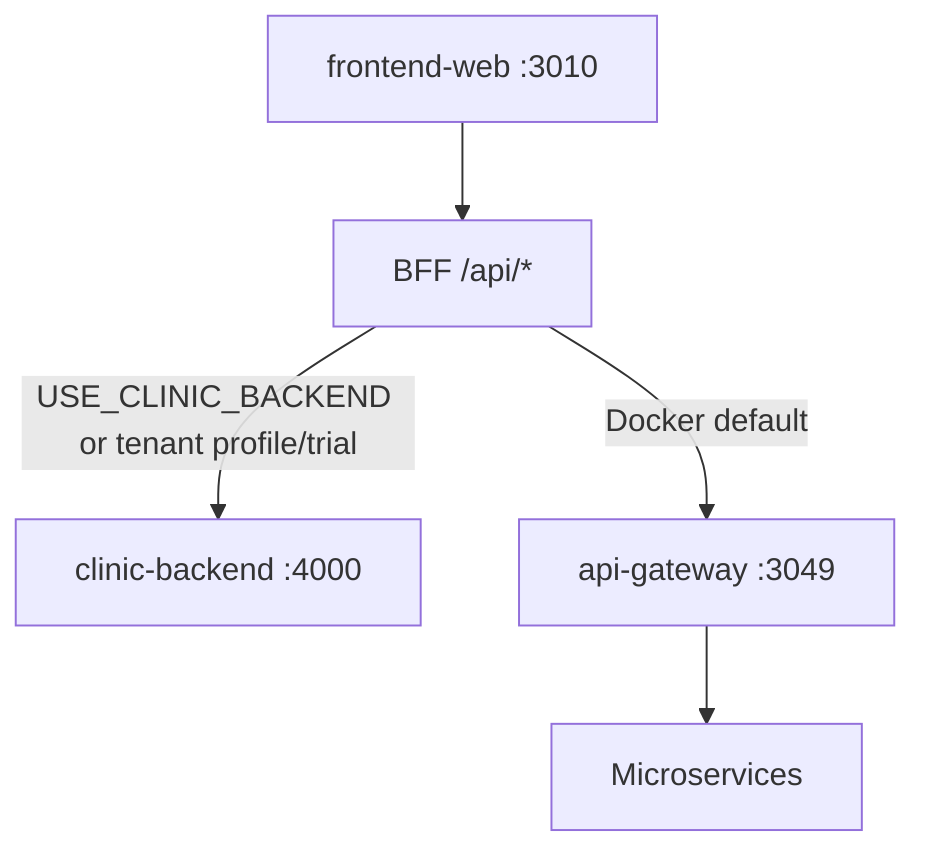

# Ordella Physio — Services & Implementation Inventory

> **Purpose:** Single reference for all services, sub-services, packages, portals, and implementation status.  
> **Last updated:** 2026-06-18  
> **Related:** [implementation-audit-tracker.md](./implementation-audit-tracker.md) · [architecture.md](./architecture.md) · [ops-reference.md](./ops-reference.md)

---

## Status legend

| Status | Meaning |
|--------|---------|
| **Implemented** | Backend + frontend wired; usable in dev/Docker |
| **Partial** | Core exists; gaps in UI, prod hardening, or dual-backend parity |
| **Waiting** | Scaffold / route exists; business logic or integration incomplete |
| **Not in dev stack** | Code in repo; not started in `docker-compose.dev.yml` |
| **Deprecated** | Superseded; do not extend |
| **Deferred** | Explicitly backlog (security / scale trigger) |

---

## Architecture at a glance

Ordella runs on **two backend paths** behind one frontend:

| Path | Location | When used |
|------|----------|-----------|
| **Clinic monolith** | `backend/` (Express + Prisma, `:4000`) | `USE_CLINIC_BACKEND=true`, onboarding, tenant profile/trial |
| **Microservices** | `services/*` + `services/api-gateway` (`:3049`) | Docker dev default, production scale-out |

**Primary app:** `apps/frontend-web` (`:3010`) — marketing, auth, all portals, BFF (`/api/*`).

---

## Shared packages (`packages/`)

| Package | Purpose | Status |
|---------|---------|--------|
| `@ordella/config` | Env schemas, service URLs | **Implemented** |
| `@ordella/database` | Prisma helpers, DB utilities | **Implemented** |
| `@ordella/domain` | Domain types and entities | **Implemented** |
| `@ordella/errors` | HTTP errors, error codes | **Implemented** |
| `@ordella/event-bus` | NATS event bus client | **Implemented** |
| `@ordella/event-contracts` | Event payload contracts | **Implemented** |
| `@ordella/middleware` | Express/Nest middleware, RBAC | **Implemented** |
| `@ordella/observability` | Logging, metrics hooks | **Implemented** |
| `@ordella/security` | JWT, RBAC, permissions | **Implemented** |
| `@ordella/shared` | DTOs, billing truth, events | **Implemented** |
| `@ordella/testing` | Test factories, helpers | **Implemented** |
| `@ordella/utils` | Shared utilities | **Implemented** |
| `@ordella/validation` | Zod schemas, pipes | **Implemented** |
| `@ordella/caching` | Cache abstractions | **Partial** |
| `@ordella/ui` | Shared UI components | **Partial** |

---

## Clinic backend — monolith modules (`backend/`)

Base path: `/api`. Used for onboarding, tenant profile/trial, and optional full clinic mode.

| Module | API prefix | Sub-capabilities | Status |
|--------|------------|------------------|--------|
| **Auth** | `/api/auth` | Login, refresh, logout, register, CSRF, MFA, users, password reset | **Implemented** |
| **Onboarding** | `/api/onboarding` | Start trial, register, checkout preview/complete, config | **Implemented** |
| **Tenant** | `/api/tenant` | Trial info, profile GET/PATCH | **Implemented** |
| **Patients** | `/api/patients` | CRUD, profile, service statements (PDF/email) | **Implemented** |
| **Appointments** | `/api/appointments` | CRUD, availability, status, cancel, complete, auto-invoice | **Implemented** |
| **Therapists** | `/api/therapists` | CRUD, schedule, service types | **Implemented** |
| **Staff** | `/api/staff` | CRUD, permissions, roles | **Implemented** |
| **Billing** | `/api/billing` | Invoices, payments, outstanding, PDF | **Implemented** |
| **Notes** | `/api/notes` | List, get, create, patch, delete | **Implemented** |
| **Reports** | `/api/reports` | Summary, revenue | **Implemented** |
| **Notifications** | `/api/notifications` | List, send, templates, read | **Partial** — email ok; SMS/push stub |
| **RBAC** | `/api/rbac` | Roles, assign | **Partial** — assign only |
| **Audit logs** | `/api/audit-logs` | List | **Implemented** |
| **Files** | `/api/files` | Upload proxy → file-storage-service | **Partial** — gateway path preferred |
| **Statements** | (via patients) | PDF generation | **Implemented** |
| **Security** | (middleware) | Brute force, token revocation, CSP helpers | **Implemented** |

**Monolith Docker:** `clinic-backend` + `clinic-backend-db` (optional profile in `docker-compose.dev.yml`).

---

## API gateway (`services/api-gateway`)

| Responsibility | Status |
|----------------|--------|
| JWT auth, tenant headers, proxy to all services | **Implemented** |
| Public routes (auth, onboarding → clinic-backend, webhooks) | **Implemented** |
| `/tenants/profile`, `/tenants/trial` → clinic-backend rewrite | **Implemented** (2026-06-18) |
| Region routing middleware | **Partial** |
| Rate limiting | **Implemented** |

**Port:** `3049` · **Docker dev:** yes

---

## Microservices — full inventory

Docker dev stack (`docker-compose.dev.yml`) runs **20 domain services** + gateway + frontend + infra.  
Full repo contains **36 service packages** (some not in dev compose).

### Platform & core

| Service | Folder | Port | Gateway prefix | Dev stack | Status | Notes |
|---------|--------|------|----------------|-----------|--------|-------|
| **Auth (core-service)** | `services/auth-service` | 3051 | `/auth` | Yes | **Implemented** | Container name `core-service` |
| **Tenant** | `services/tenant-service` | 3052 | `/tenants` | Yes | **Implemented** | CRUD, staff, branding, domains, locations, billing context |
| **Organization** | `services/organization-service` | 3066 | `/organizations` | Yes | **Implemented** | Org CRUD, org-level billing metadata |
| **User & role** | `services/user-role-service` | 3068 | `/roles` | Yes | **Implemented** | Roles, permissions |
| **Staff** | `services/staff-service` | 3069 | `/staff` | Yes | **Implemented** | Staff members per tenant |
| **Audit** | `services/audit` | 3070 | `/audit-logs` | Yes | **Implemented** | Security + domain audit |
| **Feature flags** | `services/feature-flags` | 3079 | `/ai/flags` | No | **Waiting** | Scaffold; not in dev compose |
| **Event bus** | `services/event-bus-service` | — | — | No | **Waiting** | Package exists; optional runtime |

#### Tenant-service sub-modules

| Sub-module | Routes / area | Status |
|------------|---------------|--------|
| Tenants CRUD | `/tenants`, `/tenants/:id` | **Implemented** |
| Tenant directory (public) | `/tenants/directory` | **Implemented** |
| Internal APIs | `/tenants/internal/*` | **Implemented** |
| Locations | `/tenants/:tenantId/locations` | **Implemented** |
| Tenant domains | Domain mapping, verification | **Implemented** |
| Tenant config | Namespaced config | **Implemented** |
| Localization | Timezone, currency | **Implemented** |
| Tenant billing metadata | Subscription sync hooks | **Partial** |
| Super-admin provisioning | `/super-admin/provisioning` | **Implemented** |

---

### Clinical

| Service | Folder | Port | Gateway prefix | Dev stack | Status | Notes |
|---------|--------|------|----------------|-----------|--------|-------|
| **Patient** | `services/patient-service` | 3053 | `/patients` | Yes | **Implemented** | CRUD, search, attachments |
| **Appointment** | `services/appointment-service` | 3054 | `/appointments` | Yes | **Implemented** | Scheduling, availability, blocked slots |
| **Notes** | `services/notes-service` | 3055 | `/notes` | Yes | **Implemented** | Clinical notes; JWT tenantId guard |
| **Terminal** | `services/terminal-service` | 3067 | `/terminals` | Yes | **Partial** | POS terminal registry |
| **Pharmacy** | `services/pharmacy-service` | 3085 | `/pharmacy` | Yes | **Partial** | Prescriptions + fulfillment service exists; portal still uses some BFF fallbacks |

#### Pharmacy-service sub-modules

| Sub-module | Controller | Status |
|------------|------------|--------|
| Health | `GET /pharmacy/health` | **Implemented** |
| Prescriptions | `/pharmacy/prescriptions` | **Implemented** |
| Fulfillment | `/pharmacy/fulfillment` | **Implemented** |
| Integrations | patient, staff, therapist, audit clients | **Implemented** |

---

### Billing & payments

| Service | Folder | Port | Gateway prefix | Dev stack | Status | Notes |
|---------|--------|------|----------------|-----------|--------|-------|
| **Billing** | `services/billing-service` | 3056 | `/billing` | Yes | **Partial** | Clinical invoices + **platform Stripe**; live keys E2E pending |
| **Payment** | `services/payment-service` | 3057 | `/payments` | No | **Waiting** | Webhook handlers; not in dev compose |
| **Subscription billing** | — | — | `/subscription-billing` (gateway alias → billing) | — | **Removed** | Merged into billing-service (2026-06-20) |

#### Billing-service sub-capabilities

| Capability | Status |
|------------|--------|
| Clinic invoices (CRUD, PDF) | **Implemented** |
| Stripe Checkout Session (onboarding) | **Partial** — CLI webhook ok; browser E2E pending |
| Stripe webhooks → tenant ACTIVE/SUSPENDED | **Partial** |
| Hybrid billing truth (`billingModel`) | **Implemented** |
| Platform metrics / MRR (`/billing/platform-metrics`) | **Partial** — needs live Stripe keys |
| AI notes metered invoice items | **Partial** — code shipped; dashboard verify pending |

---

### Communications

| Service | Folder | Port | Gateway prefix | Dev stack | Status | Notes |
|---------|--------|------|----------------|-----------|--------|-------|
| **Messaging** | `services/messaging-service` | 3061 | `/messaging` | Yes | **Partial** | Conversations, unread; auth timing fixes (2026-06-18) |
| **Notification** | `services/notification-service` | 3062 | `/notifications` | Yes | **Partial** | In-app ok; delivery channels stubbed |
| **Notification provider** | `services/notification-provider` | 3072 | `/notification-providers` | No | **Waiting** | Channel adapters |
| **Communication** | `services/communication-service` | 3058 | `/communication` | No | **Waiting** | Legacy comm layer |

#### Messaging-service sub-capabilities

| Capability | Status |
|------------|--------|
| Conversations CRUD | **Implemented** |
| Messages + unread count | **Implemented** |
| Real-time / WebSocket | **Waiting** |
| Attachments via file-storage | **Partial** |

---

### Reporting & search

| Service | Folder | Port | Gateway prefix | Dev stack | Status | Notes |
|---------|--------|------|----------------|-----------|--------|-------|
| **Reporting** | `services/reporting-service` | 3059 | `/reporting` | Yes | **Partial** | Summary reports; export placeholders |
| **Search index** | `services/search-index` | 3073 | `/search-index` | No (commented) | **Waiting** | Elasticsearch stub |

---

### Integrations & enterprise

| Service | Folder | Port | Gateway prefix | Dev stack | Status | Notes |
|---------|--------|------|----------------|-----------|--------|-------|
| **File storage** | `services/file-storage` | 3071 | `/files`, `/api/files` | Yes | **Partial** | S3 signed URLs; ClamAV wired when enabled |
| **Marketplace** | `services/marketplace-service` | 3064 | `/marketplace` | Yes | **Partial** | OAuth, catalog; no full calendar E2E |
| **Enterprise** | `services/enterprise-service` | 3065 | `/enterprise` | Yes | **Implemented** | SAML/OIDC SSO, org config, webhooks |

#### File-storage sub-capabilities

| Capability | Status |
|------------|--------|
| Signed URL upload/download | **Implemented** |
| Virus scan (ClamAV) | **Partial** — `CLAMAV_ENABLED=true` in dev |
| Production upload handler scan enforcement | **Deferred** |

#### Enterprise sub-capabilities

| Capability | Status |
|------------|--------|
| SAML ACS / metadata | **Implemented** |
| OIDC OAuth callback | **Implemented** |
| Org SSO config (encrypted secrets) | **Implemented** |
| Role mapping + audit | **Implemented** |

---

### AI platform (10 services)

| Service | Folder | Port | Gateway prefix | Dev stack | Status |
|---------|--------|------|----------------|-----------|--------|
| **AI (core)** | `services/ai` | 3075 | `/ai/*` | No | **Waiting** — scaffold + mocks |
| **AI notes** | `services/ai-notes-service` | 3063 | `/ai` (notes) | No | **Partial** — generation + usage metering |
| **AI gateway** | `services/ai-gateway` | 3080 | `/ai/gateway` | No | **Waiting** |
| **AI training** | `services/ai-training` | 3076 | `/ai/training` | No | **Waiting** |
| **AI monitoring** | `services/ai-monitoring` | 3077 | `/ai/drift` | No | **Waiting** |
| **AI deploy** | `services/ai-deploy` | 3078 | `/ai/deploy` | No | **Waiting** |
| **AI security** | `services/ai-security` | 3082 | `/ai/security` | No | **Waiting** |
| **AI cost** | `services/ai-cost` | 3081 | `/ai/cost` | No | **Waiting** |
| **AI observability** | `services/ai-observability` | 3083 | `/ai/observability` | No | **Waiting** |
| **AI agents** | `services/ai-agents` | 3084 | `/ai/agents` | No | **Waiting** |

**Frontend:** Clinic sidebar includes **AI platform** and automation routes; therapist **AI Notes Assistant** in notes editor is **Partial**.

---

## Infrastructure (Docker dev)

| Component | Container | Status | Purpose |
|-----------|-----------|--------|---------|
| PostgreSQL (microservices) | `ordella-physio-db` | **Implemented** | Multi-DB (`ordella_*` schemas) |
| PostgreSQL (monolith) | `ordella-clinic-backend-db` | **Implemented** | Optional clinic backend |
| Redis | `ordella-physio-redis` | **Implemented** | Cache, rate limits |
| NATS | `ordella-physio-nats` | **Implemented** | JetStream events |
| ClamAV | `ordella-physio-clamav` | **Implemented** | Upload virus scan |
| Backup cron | `clinic-backend-backup-cron` | **Implemented** | Profile `backup` only |

**Not in lightweight dev compose:** Prometheus, Grafana, Loki (see `infrastructure/deployment-layer` full stack).

---

## Frontend applications

| App | Path | Port | Status | Notes |
|-----|------|------|--------|-------|
| **frontend-web** | `apps/frontend-web` | 3010 | **Implemented** | **Primary** — all portals + BFF |
| web | `apps/web` | 3000 | **Deprecated** | Legacy marketing |
| marketing-site | `apps/marketing-site` | 3001 | **Deprecated** | |
| app | `apps/app` | 3001 | **Deprecated** | Early dashboard |
| admin-dashboard | `apps/admin-dashboard` | 3000 | **Deprecated** | |
| mobile-app | `apps/mobile-app` | Expo | **Waiting** | Separate track |

---

## Website portals & surfaces (`apps/frontend-web`)

| Portal | Base route | ~Routes | Backend mode | Status |
|--------|------------|---------|--------------|--------|
| Marketing | `/`, `/pricing`, `/contact` | 10+ | Static + contact API | **Implemented** |
| Auth / onboarding | `/login`, `/checkout`, `/register` | 12+ | Monolith + gateway | **Implemented** |
| Clinic | `/clinic` | ~110 | Dual (BFF switches) | **Implemented** (core) |
| Staff | `/staff` | ~18 | Gateway / monolith | **Implemented** |
| Therapist | `/therapist` | ~17 | Gateway / monolith | **Implemented** |
| Patient | `/patient` | ~10 | Gateway / monolith | **Implemented** |
| Pharmacy | `/pharmacy` | ~13 | Gateway + pharmacy-service | **Partial** |
| Super admin | `/super-admin` | ~33 | Gateway | **Partial** — metrics need Stripe keys |
| Organization | `/organization` | 2+ | Gateway | **Partial** — billing-focused |
| User | `/user` | ~10 | Gateway | **Implemented** |
| Settings | `/settings` | few | Mixed | **Partial** |

### Clinic portal sidebar (linked today)

Overview · Patients · Appointments · Therapists · Staff · Billing · Notes · Messages · Notifications · Marketplace · Enterprise · AI platform · Users · Roles · Locations · Terminals · Reports · Audit logs · Settings

---

## BFF proxy map (`/api/*` → gateway or monolith)

| BFF prefix | Gateway service | Monolith fallback (`USE_CLINIC_BACKEND`) |
|------------|-----------------|------------------------------------------|
| `/api/auth` | `/auth` | `/api/auth` |
| `/api/onboarding` | `/api/onboarding` → clinic-backend | `/api/onboarding` |
| `/api/tenant/profile`, `/api/tenant/trial` | clinic-backend (always) | `/api/tenant/*` |
| `/api/tenant/*` (other) | `/tenants` | — |
| `/api/patient` | `/patients` | `/api/patients` |
| `/api/appointment` | `/appointments` | `/api/appointments` |
| `/api/notes` | `/notes` | `/api/notes` |
| `/api/billing` | `/billing` | `/api/billing` |
| `/api/messaging` | `/messaging` | — |
| `/api/notifications` | `/notifications` | `/api/notifications` |
| `/api/pharmacy` | `/pharmacy` | — (gateway-only; no monolith path) |
| `/api/files` | clinic-backend | `/api/files` |
| `/api/enterprise` | `/enterprise` | — |
| `/api/marketplace` | `/marketplace` | — |

---

## Remaining work (prioritized)

### P1 — Production billing & routing

| Item | Status |
|------|--------|
| Full browser Stripe checkout E2E | **Implemented** — Playwright test with test card `4242…` + session sync helper |
| Live Stripe keys + webhook in staging/prod | **Waiting** — use `deploy/production/.env.production.example` |
| Tenant profile/trial routing to clinic-backend (gateway + BFF) | **Implemented** (2026-06-18) |
| Deprecated `/subscription-billing/*` gateway alias → billing-service | **Implemented** (2026-06-20) |

### P2 — Product completeness

| Item | Status |
|------|--------|
| Messaging auth (bearer token on reload) | **Implemented** (2026-06-18) |
| Messaging SSE realtime (`GET /messaging/stream`) | **Implemented** (2026-06-20) |
| Notification SMS/push channels (Twilio / Firebase) | **Implemented** — env-gated in notification-provider |
| Notification / messaging readiness probes | **Implemented** — `GET */ready` on messaging, notification, notification-provider |
| AI notes metered billing — verify in Stripe Dashboard | **Waiting** — needs live Stripe keys |
| Super-admin platform users CRUD polish | **Partial** |
| File upload handlers call ClamAV in prod (`CLAMAV_REQUIRED=true`) | **Implemented** — file-storage + clinic-backend scan path |
| Automated JWT key rotation (cron + overlap) | **Deferred** |
| POS terminal pairing + checkout flow | **Implemented** (2026-06-20) |
| Pharmacy portal fulfillment workflow | **Implemented** (2026-06-20) |

### P3 — Scale & differentiators

| Item | Status |
|------|--------|
| Dedicated pharmacy portal fully on pharmacy-service (drop BFF fallbacks) | **Done** — prescriptions/fulfillment on pharmacy-service; portal auxiliary reads use patient/appointment/billing APIs by design |
| Marketplace one integration E2E (calendar/Zoom) | **Waiting** |
| Real search backend (Elasticsearch) | **Waiting** |
| AI platform services out of scaffold (training, deploy, agents) | **Waiting** |
| Full Playwright provisioning + billing workflow suite | **Implemented** — serial billing E2E + failure cases |
| Payment-service in dev compose | **Waiting** |
| Search-index in dev compose | **Waiting** |
| notification-provider in dev compose | **Implemented** (2026-06-20) |
| clinic-backend in dev compose | **Profile `clinic-backend`** — opt-in only |
| All 10 AI services in dev compose | **Waiting** |

### Security deferred backlog

See `.cursor/rules/security-hardening-deferred.mdc`:

- ClamAV required on all production upload routes
- Automated JWT rotation runbook exists; scheduled rotation not wired
- Audit FK noise in security tests (low priority)

---

## Service count summary

| Category | Count |
|----------|------:|
| Microservice packages in `services/` | 36 |
| Running in `docker-compose.dev.yml` | 20 + gateway + frontend |
| Shared packages | 15 |
| Monolith domain modules | 14+ |
| Frontend portals (active app) | 10 |
| AI sub-services | 10 |
| **Implemented end-to-end (core clinic path)** | ~18 |
| **Partial / in progress** | ~15 |
| **Waiting / not in dev stack** | ~12 |
| **Deprecated** | 5 (4 legacy apps + subscription-billing) |

---

## Changelog

| Date | Change |
|------|--------|
| 2026-06-18 | Initial inventory doc: full service list, sub-modules, portal map, remaining work |
| 2026-06-18 | Added tenant profile/trial routing fix, messaging bearer-token fix to status |
| 2026-06-20 | Pharmacy + POS terminal completion; billing browser E2E; messaging SSE; notification-provider in dev compose; subscription-billing gateway alias → billing-service; readiness probes |

---

## Maintenance

Update this file when:

- A new service is added under `services/`
- A service is added/removed from `docker-compose.dev.yml`
- A portal or BFF route changes
- A capability moves from Partial → Implemented

Also update [implementation-audit-tracker.md](./implementation-audit-tracker.md) for website reflection and gap matrix.
